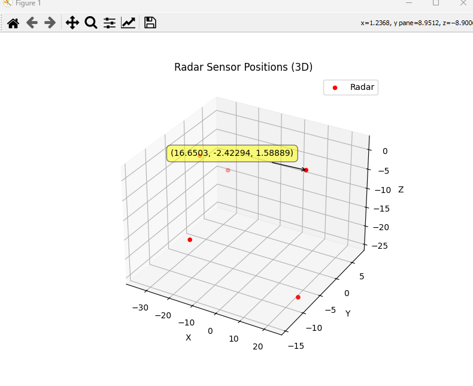

# Multithread-Sensor

## A Multithreaded Sensor Reader in C++ and Python

I built this project to teach myself multithreading in C++ and exporting CSV files in C++. My goals for this project are to gain experience in:
- Implementing threads and handling them safely
- Integrate variability in a C++ program
- Create and then analyze data contained in the CSV
- Understand sensors and gaining accurate data

## Features

### C++ Program

Currently, the location data and randomization/spread of each sensor is handled through a .json file. Each sensor has its own thread, however they share mostly the same functions which are guarded with mutex and condition variables. The program uses a queue for the combine thread as there can be multiple sensor readings at the same time. This program does technically use the Qt Framework, however it is just to read and write into a .json, I plan to change this in the future in order to remove the need to get Qt to run it.
The sensors are as follows:
- GPS
- Radar
- IMU
When the sensor readings are combined, they are then written into a .csv for use in a Python program which is described below. Combining function also utilizes a 1D Kalman Filter in order to get more accurate readings.

### Python Program

The Python program included reads in the .csv and plots it into a 3D graph and can plot all 4 types of readings, GPS, Radar, IMU, and Combined.

## Tech Stack

- C++ 17
- CMake 3.8
- Python 3
  - PyQt5
  - matplotlib
  - numpy
  - pandas

## Future Plans

For the C++ Program I plan to:
- Remove dependency on Qt
- Add more conditions for variability and more user inputs to affect the randomness, for example weather after some time

For the Python Program I plan to:
- Have a combined plot of all sensor readings
- Be able to adjust how many points are plotted
- Potentially integrate the C++ program with the Python directly instead of manually booting up the C++ then putting it into Python
